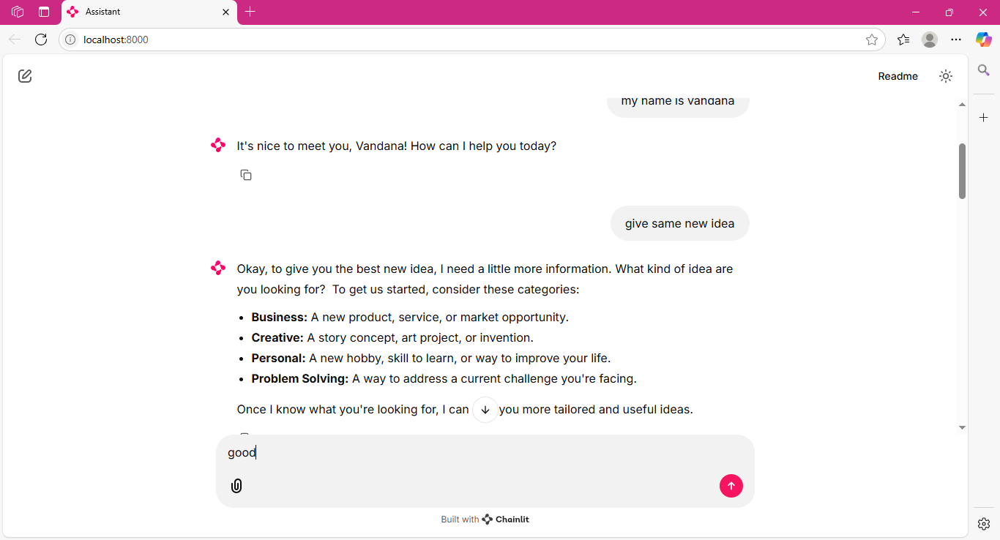

🧠 Giaic AI Assistant (Gemini + Chainlit)
This is an interactive AI assistant built with Chainlit and Gemini 2.0 Flash API. The assistant runs locally and communicates via a conversational interface in your browser.

📸 Preview

()

🚀 Features
💬 Chat interface using Chainlit

🔑 Powered by Google Gemini API (OpenAI-compatible endpoint)

📜 Session-based chat memory

📹 Demo Recording
(Optional: Add your Loom or YouTube link here if you recorded one)
Watch Demo Video

🙋‍♀️ Author
👩‍💻 Vandana Chohan

💼 LinkedIn(https://www.linkedin.com/in/vandana-chohan-0880962b7/)

📝 License
This project is open-source and free to use under the MIT License.